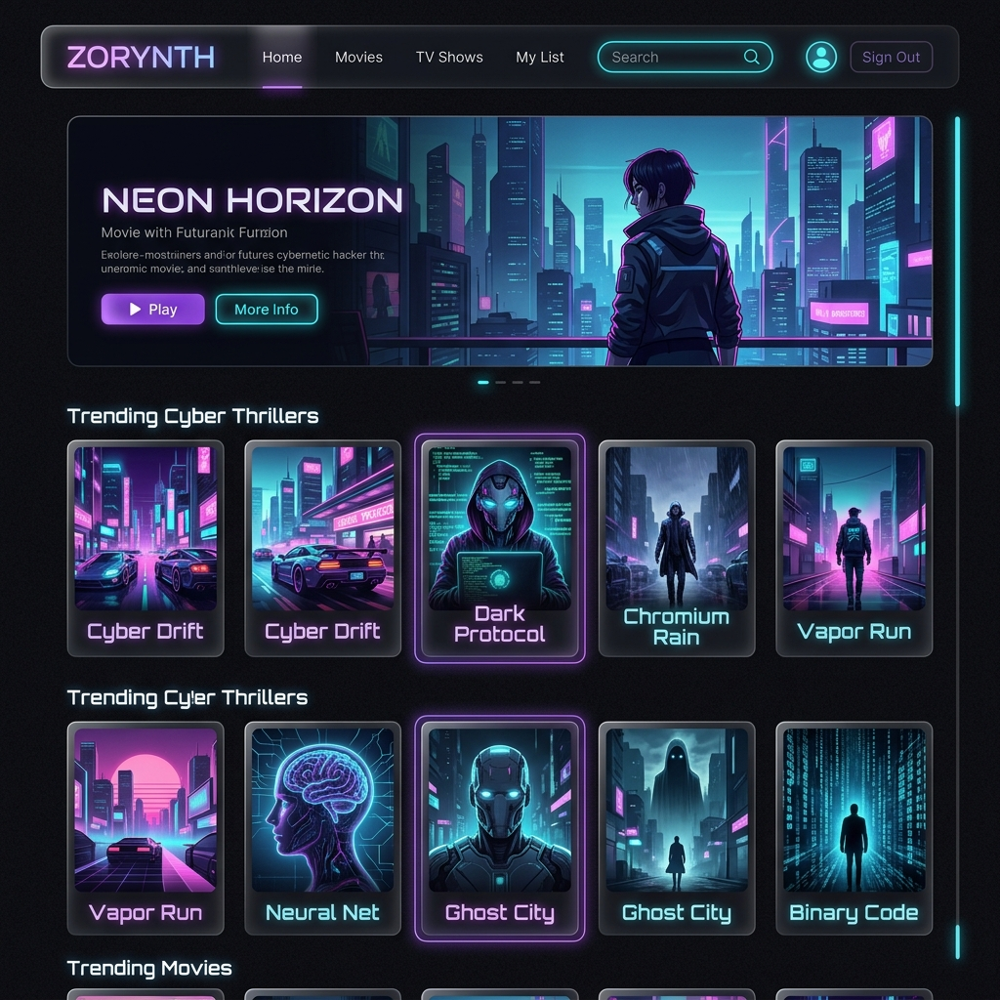
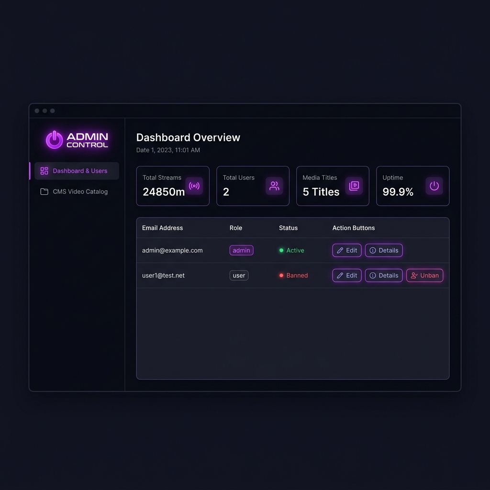

<div align="center">

# 🎬 ZORYNTH
### Cyberpunk VOD Streaming Platform

<p>
  
  
  
  
  
</p>

<p>
  
  
  
  
</p>

> A full-stack cyberpunk-themed video-on-demand streaming platform with real-time Supabase backend, multi-profile support, and a completely separate admin control panel — built with modern React 19 and TypeScript.

</div>

---

## 📸 Preview

| Consumer App | Admin Panel |
|:---:|:---:|
|  |  |
| **Browse · Watchlist · Player · Profiles** | **CMS · User Management · Analytics** |

---

## 🏗️ Architecture

```
┌─────────────────────────────────────────────────────────┐
│                     ZORYNTH PLATFORM                    │
├──────────────────────────┬──────────────────────────────┤
│   Consumer App :5173     │    Admin Panel :5174          │
│  ┌────────────────────┐  │  ┌────────────────────────┐  │
│  │  Landing Page      │  │  │  Admin Login Gate      │  │
│  │  Auth (Sign Up/In) │  │  │  Dashboard & Analytics │  │
│  │  Sub-Profiles      │  │  │  User Directory + Bans │  │
│  │  Browse Catalog    │  │  │  CMS Catalog Editor    │  │
│  │  Video Player      │  │  └────────────────────────┘  │
│  │  Watchlist         │  │           │                   │
│  │  Ratings/Reviews   │  │           │ service_role key  │
│  └────────────────────┘  │           │ (bypasses RLS)    │
│           │              │           │                   │
└───────────┼──────────────┴───────────┼───────────────────┘
            │                          │
            ▼                          ▼
┌─────────────────────────────────────────────────────────┐
│                    SUPABASE BACKEND                     │
│  ┌──────────┐ ┌──────────┐ ┌──────────┐ ┌──────────┐  │
│  │  auth    │ │  media   │ │user_roles│ │ profiles │  │
│  │  .users  │ │ watchlist│ │ (status) │ │  (email) │  │
│  └──────────┘ └──────────┘ └──────────┘ └──────────┘  │
│         Row Level Security (RLS) on all tables          │
└─────────────────────────────────────────────────────────┘
```

---

## ✨ Features

### 🎬 Consumer Streaming App (Port 5173)
| Feature | Description |
|---------|-------------|
| 🔐 **Authentication** | Email/Password + Google OAuth via Supabase Auth |
| 👤 **Multi Sub-Profiles** | Multiple viewer profiles per account (Netflix-style) |
| 🎥 **Browse Catalog** | Filter by Movies, TV Shows, Genre in real-time |
| 🔍 **Live Search** | Instant search across full media catalog |
| ❤️ **Watchlist** | Add/remove titles — persisted to database |
| ⭐ **Ratings & Reviews** | 1-5 star ratings + text reviews per title |
| ▶️ **Video Player** | Progress tracking — auto-resumes where you left off |
| 🚫 **Ban Enforcement** | Kicked out instantly if admin bans your account |

### 🛡️ Admin Control Panel (Port 5174)
| Feature | Description |
|---------|-------------|
| 🔒 **Role-Gated Login** | Only admin-role accounts can access |
| 📊 **Analytics Dashboard** | Stream minutes, active users, uptime stats |
| 👥 **User Directory** | See all registered users with real emails |
| ⚡ **Ban / Unban** | Instantly suspend accounts — kicks active sessions |
| 🎭 **Role Management** | Promote/demote users between admin and viewer |
| 🎥 **CMS Catalog Editor** | Add, edit, delete, publish/unpublish media titles |
| 🔄 **Live Sync** | Changes reflect on Consumer App immediately |

---

## 🛠️ Tech Stack

| Layer | Technology | Why |
|-------|-----------|-----|
| **UI Framework** | React 19 + TypeScript | Component-based, type-safe UI |
| **Build Tool** | Vite 8 | Lightning-fast HMR dev server |
| **Styling** | Tailwind CSS v4 | Utility-first, consistent design tokens |
| **State Management** | Zustand | Minimal, fast global state |
| **Database** | Supabase (PostgreSQL) | Real-time, RLS security, scalable |
| **Authentication** | Supabase Auth | Email + OAuth, JWT sessions |
| **Routing** | React Router v7 | Client-side navigation |
| **Icons** | Lucide React | Consistent icon system |

---

## 🗄️ Database Schema

```sql
auth.users          → Supabase built-in authentication
public.user_roles   → role (user/admin), status (active/banned)
public.profiles     → name, email, avatar per user
public.media        → title, type, category, poster, published
public.episodes     → season/episode metadata for series
public.watchlist    → profile ↔ media many-to-many
public.watch_history → playback progress per profile per media
public.ratings_reviews → star ratings + review text
```

> All tables protected with **Row Level Security (RLS)** policies.
> Trigger auto-creates `user_roles` + `profiles` on every new signup.

---

## 🚀 Getting Started

### Prerequisites
- Node.js 18+
- A [Supabase](https://supabase.com) account (free tier works)

### 1. Clone
```bash
git clone https://github.com/officialjisanhalder-art/zorynth.git
cd zorynth
```

### 2. Environment Setup
```bash
# Consumer App
cp .env.example .env

# Admin App
cp admin-app/.env.example admin-app/.env
```
Fill in your Supabase credentials from your [project settings](https://supabase.com/dashboard).

### 3. Database Setup
Run `supabase/migrations/20260703000000_zorynth_schema.sql` in your Supabase SQL Editor.

### 4. Run Both Servers
```bash
# Terminal 1 — Consumer App → http://localhost:5173
npm install && npm run dev

# Terminal 2 — Admin Panel → http://localhost:5174
cd admin-app && npm install && npm run dev
```

---

## 📁 Project Structure

```
zorynth/
├── 📂 src/                        # Consumer App
│   ├── pages/
│   │   ├── landing.tsx            # Hero landing page
│   │   ├── login.tsx              # Sign in + ban check
│   │   ├── register.tsx           # Sign up
│   │   ├── profiles.tsx           # Sub-profile selector
│   │   ├── browse.tsx             # Catalog grid + filters
│   │   └── player.tsx             # Video player + progress
│   ├── layouts/
│   │   ├── MainLayout.tsx         # Nav + session heartbeat
│   │   └── AuthLayout.tsx         # Auth wrapper
│   ├── stores/
│   │   ├── useAuthStore.ts        # Auth + role + status
│   │   └── useProfileStore.ts     # Active sub-profile
│   └── lib/supabaseClient.ts      # Supabase anon client
│
├── 📂 admin-app/                  # Separate Admin App
│   └── src/
│       ├── pages/
│       │   ├── login.tsx          # Role-gated admin login
│       │   ├── dashboard.tsx      # Analytics + user table
│       │   └── content.tsx        # CMS media editor
│       ├── layouts/AdminLayout.tsx # Sidebar navigation
│       ├── stores/useAuthStore.ts  # Admin auth store
│       └── lib/supabaseClient.ts  # Anon + service role clients
│
└── 📂 supabase/
    └── migrations/
        └── 20260703000000_zorynth_schema.sql  # Full DB schema
```

---

## 🔐 Security

- `.env` files are **git-ignored** — Supabase keys are never committed
- **RLS policies** restrict users to their own data only
- Admin panel uses **service role key** server-side to bypass RLS for admin queries
- **Ban enforcement** works in real-time — active sessions are terminated within 10 seconds

---

## 👨‍💻 Author

**Jisan Halder**
- GitHub: [@officialjisanhalder-art](https://github.com/officialjisanhalder-art)

---

<div align="center">
  <p>Built with ❤️ using React, TypeScript, Vite & Supabase</p>
  <p>⭐ Star this repo if you found it useful!</p>
</div>
