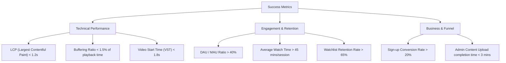
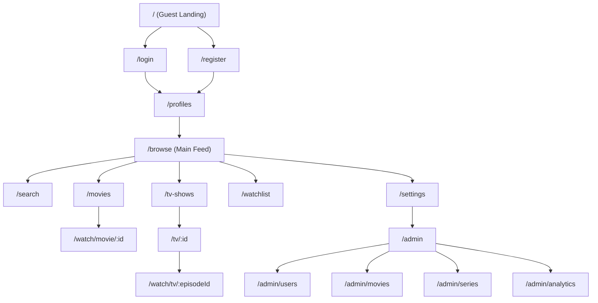
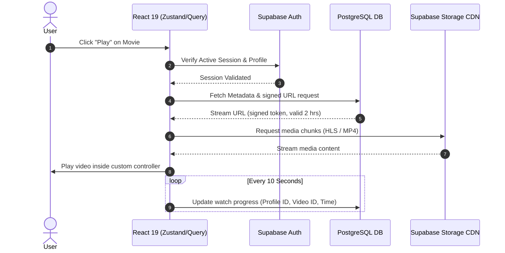
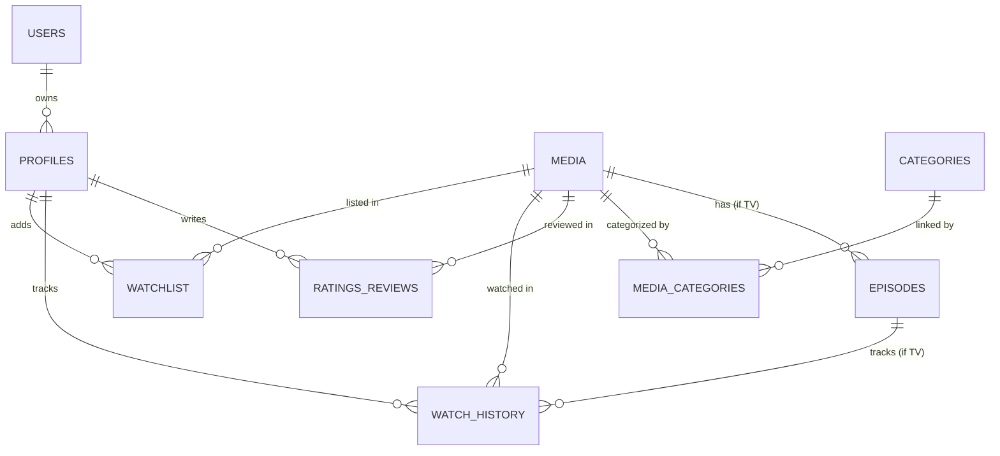
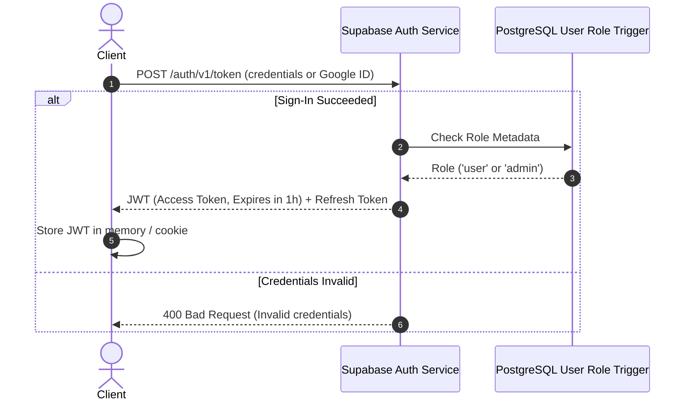
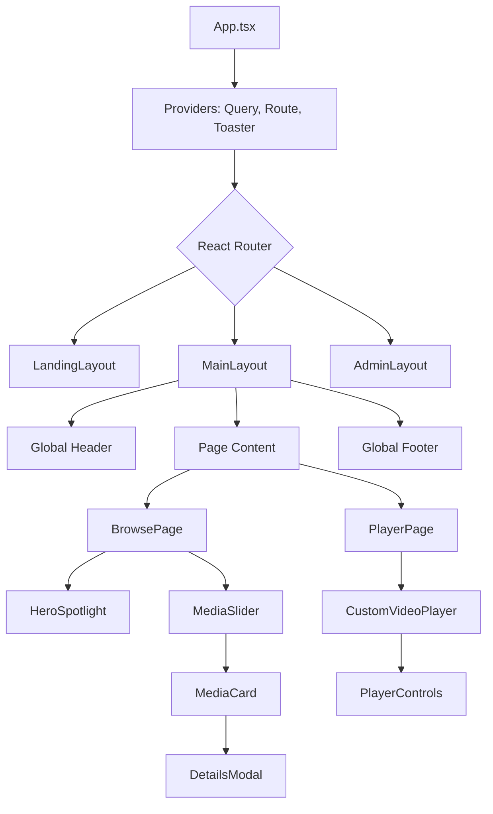

# ZORYNTH PRODUCT REQUIREMENTS DOCUMENT (PRD)
**Version:** 1.0.0  
**Author:** Principal Product Team & System Architects  
**Date:** July 3, 2026  
**Status:** Draft / Pending Review  

---

## 1. Cover Page

```
███████╗ ██████╗ ██████╗  ██╗   ██╗███╗   ██╗████████╗██╗  ██╗
╚══███╔╝██╔═══██╗██╔══██╗ ╚██╗ ██╔╝████╗  ██║╚══███╔══╝██║  ██║
  ███╔╝ ██║   ██║██████╔╝  ╚████╔╝ ██╔██╗ ██║   ██║   ███████║
 ███╔╝  ██║   ██║██╔══██╗   ╚██╔╝  ██║╚██╗██║   ██║   ██╔══██║
███████╗╚██████╔╝██║  ██║    ██║   ██║ ╚████║   ██║   ██║  ██║
╚══════╝ ╚═════╝ ╚═╝  ╚═╝    ╚═╝   ╚═╝  ╚═══╝   ╚═╝   ╚═╝  ╚═╝
```

*   **Project Name:** Zorynth
*   **Document:** Product Requirements Document (PRD)
*   **Target Release:** Q4 2026
*   **Confidentiality:** Internal Startup Use Only
*   **Tech Stack Base:** React 19, TypeScript, Vite, Tailwind CSS, shadcn/ui, Supabase (Auth, DB, Storage)

---

## 2. Revision History

| Version | Date | Author | Description | Status |
| :--- | :--- | :--- | :--- | :--- |
| **0.1.0** | 2026-07-03 | Lead PM | Initial draft layout and outline of core requirements | Draft |
| **1.0.0** | 2026-07-03 | Principal Architect | Complete system blueprint, data models, APIs, and RLS policies | Ready for Review |

---

## 3. Executive Summary

Zorynth is a premium, next-generation video-on-demand (VOD) streaming application designed to offer an immersive, fluid, and highly customized content consumption experience. In a market dominated by legacy platforms with complex, heavy, and often unresponsive interfaces, Zorynth introduces a lightning-fast web experience combining **React 19**, **Vite**, **Tailwind CSS**, and **Supabase**.

Zorynth is architected to prioritize:
1.  **Immersive Visual Design:** High-impact dark aesthetics, smooth typography (Google Fonts - Outfit/Inter), glassmorphism UI elements, and zero layouts layout-shifts.
2.  **Ultra-low Latency:** Sub-second metadata loading times via TanStack Query caching and responsive video startup via optimized Supabase Storage delivery.
3.  **Secure Multi-Tenancy/Role-Based Access Control:** Tight data isolation utilizing PostgreSQL Row Level Security (RLS) policies.

---

## 4. Product Vision

To become the ultimate personal entertainment hub that bridges the gap between high-performance web technology and cinematic immersion. Zorynth will not copy the generic, saturated grids of legacy streaming sites, but will offer a dynamic, content-focused theater in the browser, matching the fluid navigation of native TV apps.

---

## 5. Mission

To build an open-standard, portfolio-ready, and highly scalable media platform that runs flawlessly on mobile, tablet, and desktop displays, implementing clean architectural boundaries, modern state management (Zustand), and a secure serverless backend.

---

## 6. Success Metrics

Our progress and launch viability will be evaluated based on the following key metrics:



---

## 7. Business Goals

*   **Establish Portfolio Viability:** Demonstrate enterprise-grade scalability, security (RLS), and frontend performance.
*   **User Engagement:** Build features like "Continue Watching" and dynamic personalized recommendations to keep churn below 5% monthly.
*   **Extensible Architecture:** Lay down the groundwork for a transition to Premium subscriptions (Stripe) and Ad-supported tiers (AVOD) without breaking the core content delivery pipeline.

---

## 8. Scope

### In-Scope (MVP Phase)
*   **Authentication:** Email/Password sign-up/login, Google OAuth, Password Reset flows, and multi-session control.
*   **Profile Management:** Multi-profile creation (up to 4 profiles per account) with custom avatar uploading.
*   **Media Browse Engine:** Homepage showcasing Hero spotlight, Categories, Trending carousel, Top Rated, Continue Watching list, and Watchlist.
*   **Search & Filters:** Real-time search with multi-faceted filtering by genre, release year, language, and content type.
*   **Custom Video Player:** HTML5 HLS/MP4 player styled using shadcn/ui primitives. Custom UI for play/pause, volume, playback speed (0.5x to 2x), subtitle toggling, quality select, and auto-save state.
*   **Admin CMS Suite:** Complete suite for managing categories, movies, TV series, episodes, user accounts, and monitoring basic usage logs.

---

## 9. Out of Scope

*   **Live Event Streaming:** Real-time RTMP/WebRTC protocol ingest is deferred.
*   **DRM (Digital Rights Management):** Widevine or FairPlay licensing integrations are out of scope for the MVP; files will be streamed securely via scoped Supabase Signed URLs.
*   **P2P Watch Parties:** Real-time web socket synced playback is scheduled for Phase 2.
*   **Native Mobile Apps:** Apple App Store/Google Play native wrappers (React Native/Capacitor) are deferred.

---

## 10. Stakeholders

*   **Product Lead:** Defines roadmap, requirements validation, and scope negotiation.
*   **UI/UX Designer:** Creates design system tokens, typography rules, layout wireframes.
*   **Frontend Staff Engineer:** Implements React 19 patterns, Zustand stores, video player optimizations.
*   **Security & Database Admin:** Oversees Supabase setup, RLS policies, SQL migrations, index performance.
*   **QA Engineer:** Owns test suite execution (Vitest, Playwright E2E coverage).

---

## 11. Personas

### Persona A: Sarah (The Casual Viewer)
*   **Background:** 28-year-old marketing manager who streams shows on her iPad during commutes and on a TV browser at home.
*   **Needs:** Instant resume of last-watched show, effortless search, clean mobile interface.
*   **Frustrations:** Long buffering times, confusing UI navigation, losing progress when switching devices.

### Persona B: Marcus (The Cinephile)
*   **Background:** 34-year-old film archivist who demands high-quality streaming and precise technical metadata.
*   **Needs:** High-bitrate options, accurate subtitles, detailed actor/director information, filtering by release year/genre.
*   **Frustrations:** Low-resolution video, missing subtitles, lack of advanced metadata.

### Persona C: Elena (The Content Administrator)
*   **Background:** 41-year-old media operations specialist in charge of publishing assets.
*   **Needs:** Batch uploads of episodes, quick tagging of categories, user moderation, analytics on hot content.
*   **Frustrations:** Rigid CMS forms, lack of system validation before files go live, manual database editing.

---

## 12. User Journey

### Visitor to Streamer (Sarah's Journey)
1.  **Land & Auth:** Enters Zorynth homepage. Impressed by dark cinematic layout. Clicks Google Login, authenticates seamlessly.
2.  **Profile Select:** Chooses her personal "Sarah" profile (with custom avatar).
3.  **Discovery:** Scrolls through the "Trending" list, hover-previews a movie card, watches a short preview.
4.  **Watchlist:** Adds the movie to her Watchlist.
5.  **Streaming:** Clicks "Play Now". The custom player opens instantly, streaming at 1080p.
6.  **Interruption:** Closes browser tab halfway through. Later on, returns via her phone. The home feed displays "Continue Watching" showing her exact timestamp, allowing her to resume with one tap.

### CMS Publishing Journey (Elena's Journey)
1.  **Dashboard Entry:** Logs into Zorynth. Due to her Admin role, the "Admin Dashboard" link is visible in the navbar.
2.  **Navigation:** Clicks "Series Management" then "Add New Series".
3.  **Create Entity:** Enters titles, descriptions, age rating, and uploads a high-res poster (automatically resized and uploaded to Supabase Storage).
4.  **Episode Upload:** Uploads Season 1 Episode 1. The dashboard monitors upload progress and verifies the video file metadata.
5.  **Publish:** Sets status to "Published". RLS policies instantly make it visible on the Browse page for all registered users.

---

## 13. Information Architecture



---

## 14. Functional Requirements

### FR-AUTH: Authentication & Profiles
*   **FR-AUTH-1:** The system MUST support Email/Password registration with Zod-based client-side validation.
*   **FR-AUTH-2:** The system MUST offer Google OAuth login via Supabase Auth providers.
*   **FR-AUTH-3:** Users MUST verify their emails (in production) to access content.
*   **FR-AUTH-4:** Accounts MUST support up to 4 sub-profiles with unique names and customizable avatars (max image size 2MB).
*   **FR-AUTH-5:** The system MUST persist session tokens and restore session states smoothly on refresh.

### FR-BROWSE: Content Catalog & Search
*   **FR-BROWSE-1:** The main feed MUST contain a Hero Spotlight element showcasing a highlighted title with auto-playing silent background trailer.
*   **FR-BROWSE-2:** Content MUST be organized in horizontally scrollable carousels: "Trending Now", "Top Rated", "Watchlist", "Continue Watching".
*   **FR-BROWSE-3:** User watch progress MUST update in real-time and display a progress bar on the corresponding media cards.
*   **FR-BROWSE-4:** Search inputs MUST trigger debounced database requests (minimum 300ms debounce) filtering results by title, cast, director, and tags.
*   **FR-BROWSE-5:** Browse feeds MUST be filterable by Genre, Release Year, and Language.

### FR-PLAY: Video Streaming
*   **FR-PLAY-1:** The custom HTML5 video player MUST overlay play/pause, seek (+/- 10s), volume controls, and fullscreen toggles.
*   **FR-PLAY-2:** Playback speed settings MUST support speeds: 0.5x, 0.75x, 1x, 1.25x, 1.5x, 2x.
*   **FR-PLAY-3:** The player MUST pull SRT/VTT subtitle files dynamically based on language settings.
*   **FR-PLAY-4:** Playback progress MUST be synchronized with the database every 10 seconds of active playback.
*   **FR-PLAY-5:** If a video ends, the progress table MUST mark the content as fully completed.

### FR-ADMIN: Content & System Management
*   **FR-ADMIN-1:** Only authenticated users with the `admin` role in their metadata/profiles table MUST access `/admin/*` routes.
*   **FR-ADMIN-2:** Admins MUST have full CRUD control over Movie metadata, Video files, Series structures, and Categories.
*   **FR-ADMIN-3:** Admins MUST be able to ban or activate user accounts, modifying role states.
*   **FR-ADMIN-4:** The Admin dashboard MUST display high-level platform analytics (Total Streamed Minutes, Active Profiles, Top Content).

---

## 15. Non-Functional Requirements

### NFR-PERF: Performance & Optimization
*   **NFR-PERF-1:** Largest Contentful Paint (LCP) MUST be under 1.2 seconds on desktop networks and under 2.5 seconds on simulated 3G mobile networks.
*   **NFR-PERF-2:** First Input Delay (FID) / Interaction to Next Paint (INP) MUST be under 100ms.
*   **NFR-PERF-3:** Media streaming start delay (Time-to-first-frame) MUST NOT exceed 1.8 seconds.
*   **NFR-PERF-4:** Static assets (images, fonts, scripts) MUST be compressed and distributed via CDN.

### NFR-SEC: Security & Compliance
*   **NFR-SEC-1:** All database writes, reads, and updates MUST run under Supabase RLS. No anonymous access is permitted to direct streaming content.
*   **NFR-SEC-2:** User password hashes MUST be stored via Supabase Auth bcrypt mechanism.
*   **NFR-SEC-3:** All external communication MUST enforce TLS 1.3 encryption.
*   **NFR-SEC-4:** Video file links retrieved from storage MUST be short-lived signed URLs (expiry < 2 hours) to prevent hotlinking.

### NFR-AVAIL: Availability & Scalability
*   **NFR-AVAIL-1:** Platform services MUST target 99.9% uptime.
*   **NFR-AVAIL-2:** The application frontend MUST load and render a fallback offline error screen if the database is unreachable.

### NFR-A11Y: Accessibility
*   **NFR-A11Y-1:** High contrast text ratio (minimum 4.5:1) MUST be maintained across dark mode styling.
*   **NFR-A11Y-2:** Interactive player controls MUST support keyboard shortcuts (Space for Play/Pause, arrows for volume and seeking, F for fullscreen, M for mute).
*   **NFR-A11Y-3:** ARIA labels must be assigned to all icon-only buttons.

---

## 16. User Stories & 17. Acceptance Criteria

Here we detail the exact specifications for the core MVP epic features.

### Epic 1: Secure Authentication & Profiles

#### US-AUTH-1: Account Creation and Secure Login
*   **Description:** As a guest user, I want to create an account using my email and password or a Google Account so that I can access personal streaming features.
*   **User Story:** As a **Visitor**, I want to register a new account on Zorynth, so that I can unlock profile creations and watch content.
*   **Acceptance Criteria:**
    1.  *AC-1:* The registration page displays fields for Email, Password, and Confirm Password, validating email formats and password strengths (minimum 8 characters, 1 digit, 1 capital letter).
    2.  *AC-2:* Submitting the email form triggers a verification email. The account remains in a pending state until verified.
    3.  *AC-3:* Clicking the "Login with Google" button redirect users to the Google consent screen and returns them as fully authenticated users to `/profiles`.
    4.  *AC-4:* Submitting an incorrect password 5 times consecutively locks the email login method for 15 minutes.
*   **Edge Cases:**
    *   *EC-1:* Email already registered: Return a non-revealing error to prevent profile harvesting, or standard safe alert message.
    *   *EC-2:* Disruption in OAuth flow: User is returned to `/login` with an active error toast notifying them of the cancelled login.
*   **Error Handling:**
    *   Network timeouts: Display a retry button.
    *   Invalid Credentials: Standard message `"Invalid email or password combination."`
*   **Business Rules:**
    *   Email domains from disposable email provider lists are blocked.
*   **UI Behavior:**
    *   Password input field includes a visibility toggle ("eye" icon).
    *   Submit button displays a loading spinner during API requests.

---

#### US-AUTH-2: Multi-Profile Management
*   **Description:** As a primary account holder, I want to manage up to 4 unique profiles with distinct names and avatar photos so that users in my household maintain separate watch histories.
*   **User Story:** As a **Registered User**, I want to create and edit secondary profiles so that I can isolate my watch activities.
*   **Acceptance Criteria:**
    1.  *AC-1:* Upon successful login, if more than one profile exists, show the Profile Selector screen (`/profiles`).
    2.  *AC-2:* Users can create up to 4 profiles per account. The creation form requires a Profile Name (1–15 characters) and allows selecting or uploading an avatar.
    3.  *AC-3:* Active profiles can be switched at any time via a dropdown in the main header.
*   **Edge Cases:**
    *   *EC-1:* Profile limit hit: Disable the "Add Profile" card option.
    *   *EC-2:* Avatar too large: File upload triggers instant notification if file exceeds 2MB.
*   **Validation Rules:**
    *   Profile names cannot contain special characters (only alphanumeric and spaces).

---

### Epic 2: Media Discovery & Streaming



#### US-PLAY-1: Cinematic Interactive Video Player
*   **Description:** As a profile user, I want to watch my selected content inside a beautiful, custom-branded media player with interactive settings.
*   **User Story:** As a **Profile User**, I want to play a video file with custom speed, quality, and subtitle controls, so I don't have to use standard browser default designs.
*   **Acceptance Criteria:**
    1.  *AC-1:* The player opens in a true fullscreen overlay with a dark backdrop. Clicking "Esc" exits.
    2.  *AC-2:* Controls (Play, Pause, Progress Bar, Seek Back/Forward, Volume, Settings) hide after 3 seconds of cursor inactivity.
    3.  *AC-3:* Clicking the Settings cog opens a popover selecting Playback Speed (0.5x to 2x), Resolution (Auto, 1080p, 720p, 480p), and Subtitle (Off, English, Spanish).
    4.  *AC-4:* The progress bar allows dragging/seeking smoothly. The video pauses while dragging and resumes playing on release.
*   **Edge Cases:**
    *   *EC-1:* Loss of network during streaming: Show a spinning loader in the center with a descriptive overlay text: `"Connection lost. Retrying..."`. Keep trying for 30s before redirecting to details.
*   **Error Handling:**
    *   Corrupted Video File: Display error toast: `"This format cannot be played. Contact administrator."`
*   **UI Behavior:**
    *   Hovering over the progress bar displays a floating timestamp indicator.
    *   Double tapping on the left/right halves of a mobile screen seeks backward/forward by 10 seconds.

---

## 18. Database Design

### Entity Relationship Diagram (ERD)



---

## 19. PostgreSQL Tables

Below is the complete DDL representing the schema structure in PostgreSQL. This matches Supabase configurations and includes appropriate defaults, types, and constraints.

```sql
-- Enable UUID extension
CREATE EXTENSION IF NOT EXISTS "uuid-ossp";

-- 1. Profiles Table
CREATE TABLE public.profiles (
    id UUID PRIMARY KEY DEFAULT uuid_generate_v4(),
    user_id UUID NOT NULL REFERENCES auth.users(id) ON DELETE CASCADE,
    name VARCHAR(50) NOT NULL,
    avatar_url TEXT,
    created_at TIMESTAMPTZ DEFAULT NOW(),
    CONSTRAINT max_profiles_per_user CHECK (id IS NOT NULL) -- Checked via triggers in application logic
);

-- 2. Categories Table
CREATE TABLE public.categories (
    id UUID PRIMARY KEY DEFAULT uuid_generate_v4(),
    name VARCHAR(50) NOT NULL UNIQUE,
    slug VARCHAR(50) NOT NULL UNIQUE,
    created_at TIMESTAMPTZ DEFAULT NOW()
);

-- 3. Media (Movies & TV Series) Table
CREATE TABLE public.media (
    id UUID PRIMARY KEY DEFAULT uuid_generate_v4(),
    title VARCHAR(255) NOT NULL,
    slug VARCHAR(255) NOT NULL UNIQUE,
    description TEXT NOT NULL,
    type VARCHAR(10) NOT NULL CHECK (type IN ('movie', 'series')),
    release_year INT NOT NULL CHECK (release_year BETWEEN 1900 AND 2100),
    age_rating VARCHAR(10) NOT NULL DEFAULT 'PG-13',
    poster_path TEXT NOT NULL,
    backdrop_path TEXT NOT NULL,
    trailer_path TEXT,
    is_published BOOLEAN DEFAULT false,
    
    -- Movie specific columns (nullable for series)
    movie_video_path TEXT,
    movie_duration_minutes INT CHECK (movie_duration_minutes IS NULL OR movie_duration_minutes > 0),
    
    created_at TIMESTAMPTZ DEFAULT NOW()
);

-- 4. Media-Categories Association (M2M)
CREATE TABLE public.media_categories (
    media_id UUID REFERENCES public.media(id) ON DELETE CASCADE,
    category_id UUID REFERENCES public.categories(id) ON DELETE CASCADE,
    PRIMARY KEY (media_id, category_id)
);

-- 5. Episodes Table (For TV series type)
CREATE TABLE public.episodes (
    id UUID PRIMARY KEY DEFAULT uuid_generate_v4(),
    series_id UUID NOT NULL REFERENCES public.media(id) ON DELETE CASCADE,
    season_number INT NOT NULL CHECK (season_number > 0),
    episode_number INT NOT NULL CHECK (episode_number > 0),
    title VARCHAR(255) NOT NULL,
    description TEXT NOT NULL,
    duration_minutes INT NOT NULL CHECK (duration_minutes > 0),
    video_path TEXT NOT NULL,
    thumbnail_path TEXT,
    is_published BOOLEAN DEFAULT false,
    created_at TIMESTAMPTZ DEFAULT NOW(),
    UNIQUE (series_id, season_number, episode_number)
);

-- 6. Watchlist Table
CREATE TABLE public.watchlist (
    profile_id UUID NOT NULL REFERENCES public.profiles(id) ON DELETE CASCADE,
    media_id UUID NOT NULL REFERENCES public.media(id) ON DELETE CASCADE,
    created_at TIMESTAMPTZ DEFAULT NOW(),
    PRIMARY KEY (profile_id, media_id)
);

-- 7. Watch History Table
CREATE TABLE public.watch_history (
    id UUID PRIMARY KEY DEFAULT uuid_generate_v4(),
    profile_id UUID NOT NULL REFERENCES public.profiles(id) ON DELETE CASCADE,
    media_id UUID NOT NULL REFERENCES public.media(id) ON DELETE CASCADE,
    episode_id UUID REFERENCES public.episodes(id) ON DELETE CASCADE, -- Nullable for standalone movies
    progress_seconds INT NOT NULL DEFAULT 0 CHECK (progress_seconds >= 0),
    is_completed BOOLEAN NOT NULL DEFAULT false,
    updated_at TIMESTAMPTZ DEFAULT NOW(),
    
    -- Ensure a profile has one history entry per movie or episode
    UNIQUE (profile_id, media_id, episode_id)
);

-- 8. Ratings & Reviews Table
CREATE TABLE public.ratings_reviews (
    id UUID PRIMARY KEY DEFAULT uuid_generate_v4(),
    profile_id UUID NOT NULL REFERENCES public.profiles(id) ON DELETE CASCADE,
    media_id UUID NOT NULL REFERENCES public.media(id) ON DELETE CASCADE,
    rating INT NOT NULL CHECK (rating BETWEEN 1 AND 5),
    review_text TEXT CHECK (CHAR_LENGTH(review_text) <= 1000),
    created_at TIMESTAMPTZ DEFAULT NOW(),
    UNIQUE (profile_id, media_id)
);

-- 9. User Roles Metadata Table (Managed via Auth / Admin Triggers)
CREATE TABLE public.user_roles (
    user_id UUID PRIMARY KEY REFERENCES auth.users(id) ON DELETE CASCADE,
    role VARCHAR(20) NOT NULL DEFAULT 'user' CHECK (role IN ('user', 'admin')),
    created_at TIMESTAMPTZ DEFAULT NOW()
);
```

---

## 20. Relationships

*   `profiles.user_id` links directly to Supabase Auth's `auth.users(id)`. Profile deletion cascades with account deletions.
*   `media_categories` resolves the many-to-many relationship between `media` and `categories`.
*   `episodes` references `media.id` ensuring episode sequences belong to a valid series entry.
*   `watch_history` tracks relative viewer offsets. If the media type is `movie`, `episode_id` is constraint-validated to be `NULL`. If the media type is `series`, `episode_id` MUST reference a valid ID in the `episodes` table.

---

## 21. Indexes

To optimize read lookups under heavy user loads, we define the following indices:

```sql
-- Optimize search filter & lookup by type/published state
CREATE INDEX idx_media_published_type ON public.media(is_published, type);
CREATE INDEX idx_media_slug ON public.media(slug);

-- Optimize profile specific lists
CREATE INDEX idx_profiles_user ON public.profiles(user_id);
CREATE INDEX idx_watchlist_profile ON public.watchlist(profile_id);
CREATE INDEX idx_history_profile_lookup ON public.watch_history(profile_id, updated_at DESC);

-- Optimize episode listings for Series details page
CREATE INDEX idx_episodes_series_season ON public.episodes(series_id, season_number, episode_number);
```

---

## 22. Supabase Storage Structure

We segregate files into distinct storage buckets with specific caching rules:

| Bucket Name | Accessibility | Subfolders | Allowed Formats | Max File Size | Cache-Control TTL |
| :--- | :--- | :--- | :--- | :--- | :--- |
| **avatars** | Public | `/users/*` | `.jpg`, `.jpeg`, `.png` | 2 MB | 86400 (24h) |
| **media-assets** | Public | `/posters/*`<br>`/backdrops/*`<br>`/thumbnails/*` | `.jpg`, `.jpeg`, `.png`, `.webp` | 5 MB | 604800 (7d) |
| **videos** | Private | `/movies/*`<br>`/episodes/*`<br>`/trailers/*` | `.mp4`, `.m3u8`, `.ts` | 2 GB (trailers/test videos) | 0 (No cache / signed URLs only) |
| **subtitles** | Public | `/vtt/*` | `.vtt`, `.srt` | 500 KB | 86400 (24h) |

---

## 23. Authentication Flow

Users sign in using either password-based OAuth paths or direct Google redirect triggers:



---

## 24. Authorization Matrix

| User Role | View Media Metadata | Stream Video | Manage Profile Details | Create/Delete Profiles | CRUD Content (CMS) | Moderate Accounts |
| :--- | :--- | :--- | :--- | :--- | :--- | :--- |
| **Guest** | :x: | :x: | :x: | :x: | :x: | :x: |
| **User (Registered)** | :white_check_mark: | :white_check_mark: | :white_check_mark: | :white_check_mark: | :x: | :x: |
| **Admin** | :white_check_mark: | :white_check_mark: | :white_check_mark: | :white_check_mark: | :white_check_mark: | :white_check_mark: |

---

## 25. RLS Policies

To secure PostgreSQL datasets directly, Row Level Security (RLS) is enabled.

```sql
-- Enable RLS on all tables
ALTER TABLE public.profiles ENABLE ROW LEVEL SECURITY;
ALTER TABLE public.media ENABLE ROW LEVEL SECURITY;
ALTER TABLE public.watchlist ENABLE ROW LEVEL SECURITY;
ALTER TABLE public.watch_history ENABLE ROW LEVEL SECURITY;
ALTER TABLE public.ratings_reviews ENABLE ROW LEVEL SECURITY;
ALTER TABLE public.user_roles ENABLE ROW LEVEL SECURITY;

-- Helper function to check admin status
CREATE OR REPLACE FUNCTION public.is_admin()
RETURNS BOOLEAN AS $$
BEGIN
  RETURN EXISTS (
    SELECT 1 FROM public.user_roles 
    WHERE user_id = auth.uid() AND role = 'admin'
  );
END;
$$ LANGUAGE plpgsql SECURITY DEFINER;

-- 1. Profiles Policies
CREATE POLICY "Users can view profiles belonging to their account"
    ON public.profiles FOR SELECT
    USING (user_id = auth.uid());

CREATE POLICY "Users can create profiles under their account"
    ON public.profiles FOR INSERT
    WITH CHECK (user_id = auth.uid());

CREATE POLICY "Users can edit profiles under their account"
    ON public.profiles FOR UPDATE
    USING (user_id = auth.uid());

-- 2. Media Policies
CREATE POLICY "Anyone authenticated can view published media"
    ON public.media FOR SELECT
    USING (auth.role() = 'authenticated' AND is_published = true);

CREATE POLICY "Admins have full access to media"
    ON public.media FOR ALL
    USING (public.is_admin());

-- 3. Watchlist Policies
CREATE POLICY "Users can manage watchlist for their owned profiles"
    ON public.watchlist FOR ALL
    USING (EXISTS (
        SELECT 1 FROM public.profiles 
        WHERE id = watchlist.profile_id AND user_id = auth.uid()
    ));

-- 4. Watch History Policies
CREATE POLICY "Users can manage history for their profiles"
    ON public.watch_history FOR ALL
    USING (EXISTS (
        SELECT 1 FROM public.profiles 
        WHERE id = watch_history.profile_id AND user_id = auth.uid()
    ));
```

---

## 26. API Design

Zorynth utilizes Supabase's auto-generated PostgREST endpoints and remote procedure calls (RPC).

### 1. Fetch Home Feed Collections
*   **Method / Route:** `GET /rest/v1/media`
*   **Query Parameters:** `select=*,categories(*)&is_published=eq.true&order=created_at.desc`
*   **Headers:** `Authorization: Bearer <JWT>`
*   **Success Response (200 OK):**
    ```json
    [
      {
        "id": "7a3b30bd-22df-424a-9ef8-ec9df174a7ee",
        "title": "Neon Horizon",
        "slug": "neon-horizon",
        "description": "A deep dive into futuristic metropolitan architectures.",
        "type": "movie",
        "release_year": 2026,
        "age_rating": "PG-13",
        "poster_path": "/posters/neon_horizon.webp",
        "backdrop_path": "/backdrops/neon_horizon_back.webp",
        "movie_duration_minutes": 118,
        "is_published": true,
        "categories": [
          { "id": "1", "name": "Sci-Fi", "slug": "sci-fi" }
        ]
      }
    ]
    ```

### 2. Update Playback Progress (Heartbeat Sync)
*   **Method / Route:** `POST /rest/v1/watch_history`
*   **Headers:** `Authorization: Bearer <JWT>`, `Prefer: resolution=merge-duplicates`
*   **Request Payload:**
    ```json
    {
      "profile_id": "c353982e-9d24-4f81-a75d-6395ec19e7a8",
      "media_id": "7a3b30bd-22df-424a-9ef8-ec9df174a7ee",
      "episode_id": null,
      "progress_seconds": 1200,
      "is_completed": false,
      "updated_at": "now()"
    }
    ```
*   **Success Response (201 Created / 204 No Content):** Empty return.
*   **Error Response (400 Bad Request):**
    ```json
    {
      "code": "23503",
      "message": "insert or update on table \"watch_history\" violates foreign key constraint \"watch_history_profile_id_fkey\"",
      "details": "Key (profile_id)=(c353982e-9d24-4f81-a75d-6395ec19e7a8) is not present in table \"profiles\"."
    }
    ```

---

## 27. Frontend Architecture

Zorynth utilizes a single-page application (SPA) model powered by **Vite** and **React 19**, written in strict **TypeScript**. 

Key architectural components include:
*   **Routing:** React Router v6 for declarations, utilizing layouts and lazy loading for code splitting.
*   **State Management:** **Zustand** for lightweight client-side global stores (auth, active profile context, active player states) and **TanStack Query (React Query) v5** for server state sync, caching, and background queries.
*   **Styling:** **Tailwind CSS** with **shadcn/ui** components for styling foundations.

---

## 28. Folder Structure

```
zorynth-client/
├── .github/                  # CI/CD Workflows
├── public/                   # Static assets (favicons, manifest.json)
└── src/
    ├── assets/               # Branding vectors, default avatars
    ├── components/
    │   ├── ui/               # Radix / shadcn/ui base elements (Button, Dialog, Card)
    │   ├── common/           # Custom reusable blocks (Header, Footer, Spinner)
    │   ├── browse/           # Catalog UI (MediaSlider, HeroSpotlight, CategoryTabs)
    │   ├── watch/            # Player components (CustomControls, SettingsPopover)
    │   └── admin/            # CMS components (UserTable, ContentForm, UploadProgress)
    ├── hooks/                # Custom React queries (useMedia, useWatchlist, useHistory)
    ├── layouts/              # Route wrappers (AuthLayout, MainLayout, AdminLayout)
    ├── lib/                  # Library initializations (supabaseClient.ts, utils.ts)
    ├── pages/                # Route endpoints
    │   ├── landing.tsx
    │   ├── login.tsx
    │   ├── profiles.tsx
    │   ├── browse.tsx
    │   ├── details.tsx
    │   ├── player.tsx
    │   └── admin/
    │       ├── dashboard.tsx
    │       └── content.tsx
    ├── stores/               # Zustand global state definitions
    │   ├── useAuthStore.ts
    │   ├── useProfileStore.ts
    │   └── usePlayerStore.ts
    ├── types/                # TypeScript interface mappings (database.types.ts)
    ├── App.tsx               # Main component loading routes & providers
    ├── index.css             # Tailwind imports & CSS variable variables
    └── main.tsx              # Application mount point
```

---

## 29. Component Architecture



---

## 30. State Management

Zorynth uses **Zustand** stores for localized client states.

### 1. Account / Auth Store (`useAuthStore`)
Tracks session token states:
```typescript
interface AuthState {
  user: User | null;
  session: Session | null;
  role: 'user' | 'admin' | null;
  loading: boolean;
  setSession: (session: Session | null) => void;
  setRole: (role: 'user' | 'admin' | null) => void;
  logout: () => Promise<void>;
}
```

### 2. Profile Context Store (`useProfileStore`)
Keeps track of which sub-profile is actively browsing/watching:
```typescript
interface ProfileState {
  currentProfile: Profile | null;
  profiles: Profile[];
  setProfile: (profile: Profile) => void;
  setProfiles: (profiles: Profile[]) => void;
  clearProfile: () => void;
}
```

### 3. TanStack Query Keys
Server queries are managed via React Query:
*   `['media', 'trending']`: Trending titles.
*   `['media', id]`: Single movie or series item.
*   `['watchlist', profileId]`: Target watchlists.
*   `['history', profileId]`: Target resume items.

---

## 31. UI Design System

Zorynth uses an original premium design theme inspired by a cyberpunk dark mode aesthetic (Royal Purple & Neon Cyan).

### 32. Typography
*   **Primary Font Family:** `Outfit` (sans-serif) for high-impact headers and spotlights.
*   **Body Font Family:** `Inter` (sans-serif) for highly legible body, description metadata, and input forms.
*   **Size Hierarchy:**
    *   `h1`: `3rem / 48px` (Semibold)
    *   `h2`: `2.25rem / 36px` (Semibold)
    *   `h3`: `1.5rem / 24px` (Medium)
    *   `body-base`: `1rem / 16px` (Regular)
    *   `metadata`: `0.875rem / 14px` (Light)

### 33. Color Palette (HSL System)
We define our system using clean CSS variables:

```css
:root {
  --background: 240 10% 4%;        /* Near Pitch Black */
  --foreground: 210 20% 98%;       /* Crisp White */
  
  --card: 240 10% 8%;              /* Dark Charcoal */
  --card-foreground: 210 20% 98%;
  
  --primary: 270 95% 60%;          /* Electric Royal Purple */
  --primary-foreground: 0 0% 100%;
  
  --secondary: 180 100% 50%;        /* Vibrant Neon Cyan (Accent) */
  --secondary-foreground: 240 10% 4%;
  
  --muted: 240 5% 26%;             /* Dark Slate Grey */
  --muted-foreground: 240 5% 65%;  /* Mid Slate Grey */
  
  --border: 240 5% 15%;            /* Subtle Outline */
  --ring: 270 95% 60%;
}
```

### 34. Icons
All icons are dynamically loaded SVG vectors from the **lucide-react** library:
*   `Play`, `Pause`, `RotateCcw` (+10s), `RotateCw` (-10s): Video Controls.
*   `Volume2`, `VolumeX`, `Maximize`, `Minimize`: Player actions.
*   `Search`, `ChevronDown`, `ChevronRight`: Navigation.
*   `Plus`, `Check`, `Heart`, `Info`: Interaction buttons.

### 35. Spacing System
Zorynth aligns components to a strictly grid-based layout:
*   `gap-2` (8px), `gap-4` (16px) for inner card margins and settings options.
*   `py-12 / px-16` for carousel margins.
*   Container margins default to standard padding: `px-4 md:px-12 lg:px-16`.

### 36. Responsive Breakpoints
Our responsive engine follows a Mobile-First layout methodology:
*   `sm`: `640px` (Compact phone portrait feeds).
*   `md`: `768px` (Tablet layouts; display extra carousel cards).
*   `lg`: `1024px` (Small desktop/laptop viewport layouts).
*   `xl`: `1280px` (Large screen layouts; show high-res backdrops).

---

## 37. Accessibility (WCAG 2.1 AA)

- [ ] **Contrast Verification:** Ensure all text passes minimum 4.5:1 ratio checks using static CSS audits.
- [ ] **Keyboard Navigable Player:** Tab-stops correctly focus player controls. Spacebar handles pause/play toggle natively.
- [ ] **Screen Reader Descriptions:** High-res image posters include detailed `alt="Poster for [title]"` attributes.
- [ ] **Focus Rings:** Focused buttons and inputs draw a bright `--secondary` outline (`ring-offset-2`).

---

## 38. Performance Goals

*   **Code Splitting:** React routes use `React.lazy()` separating page weight imports.
*   **Virtual Scroll Grid:** Long lists (such as Search results or large Categories) render inside a virtual window (using `@tanstack/react-virtual`) to limit the total number of live DOM nodes.
*   **Image Transcoding:** Posters are loaded as modern `.webp` formats dynamically scaled via Supabase CDN queries (`?width=400`).

---

## 39. SEO Strategy

Although Zorynth is a secure dashboard application, the landing pages and main titles use crawlable headers to facilitate external search indexing:

```html
<!-- Example Document Head inside Landing Page -->
<title>Zorynth - Cyberpunk Premium Video Streaming Hub</title>
<meta name="description" content="Discover, watchlist, and stream the latest indie movies and series in ultra-low latency with Zorynth." />
<meta property="og:title" content="Zorynth - Cyberpunk Premium Video Streaming Hub" />
<meta property="og:image" content="https://zorynth.vercel.app/og-banner.jpg" />
<meta property="og:type" content="video.movie" />
<meta name="robots" content="index, follow" />
```

---

## 40. Security Requirements

*   **CORS (Cross-Origin Resource Sharing):** Supabase Storage video stream endpoints restrict playback origins exclusively to the production domain (`https://*.zorynth.com` or local dev configurations).
*   **Rate Limiting:** API requests to authentication and search endpoints are limited via Supabase API Gateway defaults (max 100 requests per minute per IP address).
*   **XSS Mitigation:** React 19 natively sanitizes text outputs inside component trees. Markdown descriptions in media are sanitized via `dompurify` before injection.
*   **Token Expiry & Rotation:** JWT tokens expire in 1 hour; Refresh Tokens are securely stored in `localStorage` with automated rotation.

---

## 41. Logging

System messages and API transaction failures conform to a structured JSON format to assist debugging:

```json
{
  "timestamp": "2026-07-03T05:32:15Z",
  "level": "ERROR",
  "profile_id": "c353982e-9d24-4f81-a75d-6395ec19e7a8",
  "action": "STREAM_HEARTBEAT_FAIL",
  "context": {
    "media_id": "7a3b30bd-22df-424a-9ef8-ec9df174a7ee",
    "progress_seconds": 1200,
    "db_code": "23503"
  },
  "message": "Failed to update watch progress: Foreign Key profile_id mismatch."
}
```

---

## 42. Monitoring

*   **Sentry Integration:** Client-side errors, uncaught promise rejections, and video load failures trigger immediate Sentry incident reports.
*   **Latency Monitoring:** Heartbeat latency metrics (API endpoints update speed) are tracked via OpenTelemetry collectors.
*   **Streaming Health:** Playback buffering events, stalls, and stream startup latency are logged to monitor CDN bottlenecks.

---

## 43. Error Handling

*   **Global Error Boundary:** The React application is wrapped in a high-level `ErrorBoundary` component that renders a fallback "System Offline" page if an uncaught runtime error is thrown.
*   **Interactive Toast Notifications:** API errors (e.g. watchlist additions failure) are captured and displayed to the user via non-blocking toast notifications.
*   **Fallback Pages:** Non-existent routes route natively to a branded custom 404 page.

---

## 44. Analytics

To track application growth without invading user privacy, we capture standard telemetry logs:
*   **Session Track:** Records profile visits to target browse categories.
*   **Stream Start/Stop Events:** Profiles' engagement metrics (Watch time, completion status) to train recommendation engines.
*   **Popular Searches:** Debounced search queries are audited to identify missing content requests.

---

## 45. Testing Strategy

Zorynth implements a layered testing strategy consisting of:
*   **Unit Tests:** Focus on stores, utility functions, and mock API requests.
*   **Integration Tests:** Validate critical user workflows (Profile Select, Custom Video Player state transitions).
*   **E2E Tests:** Execute real browser environments for main sign-up, dashboard controls, and playback.

---

## 46. Unit Testing

Unit tests are written in **Vitest** and executed using **React Testing Library**:

```typescript
// Example: Testing Zustand Profile Store Selection
import { describe, it, expect, beforeEach } from 'vitest';
import { useProfileStore } from '../stores/useProfileStore';

describe('Profile Store', () => {
  beforeEach(() => {
    useProfileStore.getState().clearProfile();
  });

  it('should select active profile and store it', () => {
    const mockProfile = { id: 'p1', name: 'Sarah', avatar_url: '' };
    useProfileStore.getState().setProfile(mockProfile);
    expect(useProfileStore.getState().currentProfile?.name).toBe('Sarah');
  });
});
```

---

## 47. Integration Testing

Focuses on validating API responses and hook operations:
*   Testing that `useMedia` fetches and properly orders movie categories.
*   Verifying that clicking a media item card opens the Details Modal overlay populated with details from TanStack Query cache.

---

## 48. E2E Testing

End-to-end tests are implemented using **Playwright**:

```typescript
// Example: Login and Playback flow test
import { test, expect } from '@playwright/test';

test('User can log in, select profile, and launch video player', async ({ page }) => {
  await page.goto('/login');
  await page.fill('input[type="email"]', 'sarah@zorynth.com');
  await page.fill('input[type="password"]', 'Password123');
  await page.click('button[type="submit"]');

  await page.waitForURL('/profiles');
  await page.click('text=Sarah');

  await page.waitForURL('/browse');
  await page.click('text=Play Now');

  await page.waitForSelector('video');
  const video = page.locator('video');
  await expect(video).toBeVisible();
});
```

---

## 49. Deployment Strategy

*   **Frontend (Vercel):** The production web server is hosted on Vercel, building files via Vite. Edge middleware handles redirect rules for authentications.
*   **Backend (Supabase):** Managed PostgreSQL, Storage buckets, and Identity Provider layers are hosted on Supabase's regional serverless infra.

---

## 50. CI/CD Pipeline

The GitHub Actions workflow triggers on Pull Requests to main/dev branches:

```yaml
name: Zorynth CI/CD

on:
  push:
    branches: [main, dev]
  pull_request:
    branches: [main]

jobs:
  build-and-test:
    runs-on: ubuntu-latest
    steps:
      - name: Checkout Repository
        uses: actions/checkout@v4

      - name: Setup Node.js
        uses: actions/setup-node@v4
        with:
          node-version: 20
          cache: 'npm'

      - name: Install Dependencies
        run: npm ci

      - name: Lint Codebase
        run: npm run lint

      - name: Execute Vitest
        run: npm run test:unit

      - name: Build Application
        run: npm run build
```

---

## 51. Git Branching Strategy

Zorynth implements Trunk-Based Development with semantic branch structures:
*   `feat/`: Introducing new features (e.g. `feat/player-subtitles`).
*   `fix/`: Resolving bugs (e.g. `fix/profile-avatar-overflow`).
*   `chore/`: Project configuration and library updates.
*   `main`: Mirroring stable production environment.
*   `dev`: Staging site integration branch.

---

## 52. Coding Standards

*   **Linting (ESLint):** Enforces strict TypeScript rules (`@typescript-eslint/recommended`), preventing raw type injections and unused imports.
*   **Formatting (Prettier):** Single quotes, semi-colons, tab width 2, and trailing commas are formatted on file saves.
*   **React Conventions:** Enforces functional components using arrow structures, avoiding legacy class setups.

---

## 53. Naming Conventions

*   **Component Files:** PascalCase (e.g., `HeroSpotlight.tsx`).
*   **Helper Utilities:** camelCase (e.g., `formatDuration.ts`).
*   **CSS Styles:** kebab-case classes matching Tailwind conventions.
*   **Database Objects:** snake_case tables and variables (e.g. `watch_history`, `profile_id`).

---

## 54. Environment Variables

Below variables must be configured on deployment targets (e.g. `.env.production`):

```bash
# Supabase Client Credentials
VITE_SUPABASE_URL=https://your-project-id.supabase.co
VITE_SUPABASE_ANON_KEY=eyJhbGciOiJIUzI1NiIsInR5cCI6IkpXVCJ9...

# Analytics Configuration
VITE_ANALYTICS_WRITE_KEY=segment-telemetry-id
```

---

## 55. Future Roadmap

1.  **Stripe Billing Integration:** Upgrading accounts to Premium status to watch high-bitrate content.
2.  **Live Sync Watchrooms:** Real-time video player synchronization via WebRTC.
3.  **Smart TV Layout Support:** 10ft User Interface navigable with remote controls.

---

## 56. Risks

*   **Bandwidth Overcharges:** Large media asset deliveries can consume free storage tier quotas. Mitigation: Implement aggressive Cloudflare CDN cache policies on videos and static assets.
*   **OAuth Account Hijacking:** Google OAuth account details alterations could orphan user profiles. Mitigation: Implement tight backup recovery options in the user profile table.

---

## 57. Assumptions

*   Users are streaming from modern devices with HTML5 standard web page playback support.
*   The project will use the basic free/pro quotas of Supabase to prove initial concepts.

---

## 58. Milestones

*   **Milestone 1:** Core Setup & Auth Schema (Weeks 1-2)
*   **Milestone 2:** Media Listings & Switching Profiles (Weeks 3-4)
*   **Milestone 3:** Custom Video Player & Progress Saves (Weeks 5-6)
*   **Milestone 4:** CMS Dashboards & Performance Audits (Weeks 7-8)
*   **Milestone 5:** Launch Integration & Final Verification (Week 9)

---

## 59. Sprint Planning

### Sprint 1: Foundation & Auth (Weeks 1-2)
*   Setup Vite React 19 boilerplate.
*   Deploy Supabase schema, relations, and RLS rules.
*   Implement sign-up/login pages.

### Sprint 2: Browse & Search (Weeks 3-4)
*   Build Home feed, spotlight element, category tabs.
*   Implement debounced Postgres search APIs.
*   Setup watchlists and profile switching context.

### Sprint 3: Cinematic Video Playback (Weeks 5-6)
*   Build Custom HTML5 Video Player using Tailwind theme components.
*   Sync watch progress (heartbeat API updates) to Supabase tables.
*   Configure private storage buckets with secure signed URLs.

### Sprint 4: Admin Panel & QA (Weeks 7-8)
*   Design Admin CMS dashboards.
*   Conduct WCAG AA accessibility tests.
*   Run unit and E2E testing pipelines before production launch.

---

## 60. Appendix

*   [Supabase Documentation Pages](https://supabase.com/docs)
*   [React 19 Official Release Notes](https://react.dev/blog/2024/12/05/react-19)
*   [TanStack Query v5 Docs](https://tanstack.com/query/v5)
*   [Tailwind CSS Grid & Typography Utilities](https://tailwindcss.com/docs)

